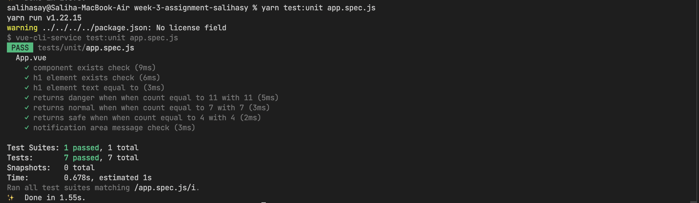
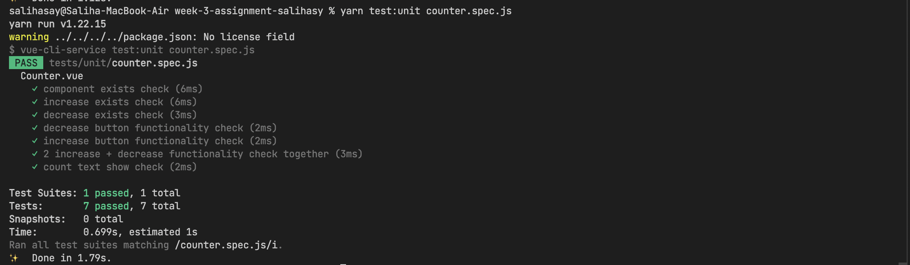

# Unit Tests


---
1. h1 exists 
2. h1 text equals to `Daily Corona Cases in Turkey` check
3. notificationArea class check based on `getCount` value
4. notificationArea text message check

<br/>


---
1. Component Exist Check
2. Increase button exist check
3. Decrease button exist check
4. Increase button functionality check
5. Decrease button functionality check
6. 2 increase + decrease functionality check together
7. Count text show check


<br />

## **TITLES**
---
* [Description](#description)
* [Technologies](#technologies)
* [Setup](#setup)
* [Sources](#sources)

<br />

## Description
---
This project is unit tests for App.vue and Counter.vue

<br/>

## Technologies
---
Project is created with:
* **Javascript**
* **Vuex**
* **Jest**

<br />

## Setup
---

### Project Setup
```
yarn install
```

### Compiles and hot-reloads for development
```
yarn serve
```

### Compiles and minifies for production
```
yarn build
```

### Run your unit tests
```
yarn test:unit
```